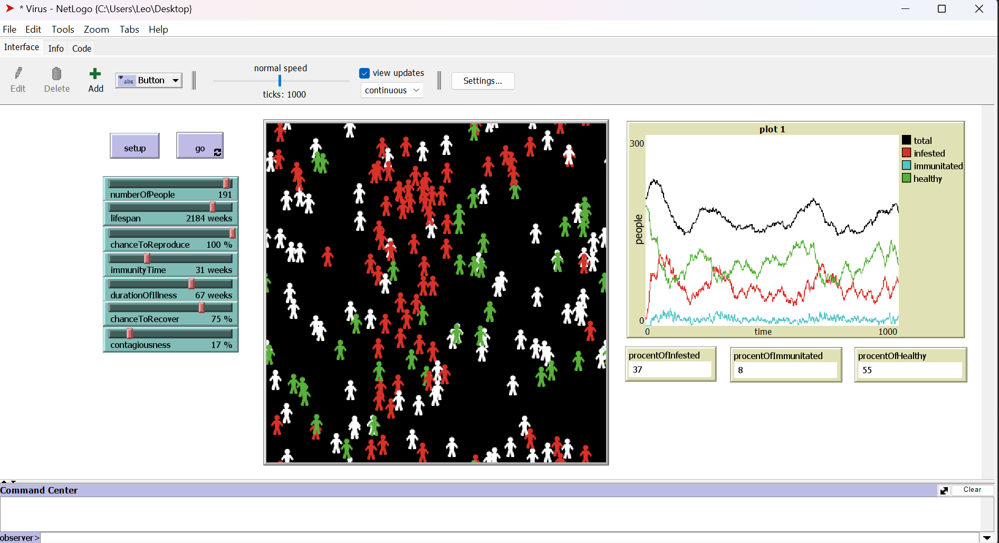

# Проект "Virus Simulation в NetLogo"



## Описание

Этот проект представляет собой симуляцию распространения вируса с использованием языка программирования NetLogo. Симуляция моделирует поведение индивидуумов в замкнутом пространстве и исследует, как быстро и широко может распространяться вирус в такой среде.

## Функциональности

- Создание агентов (людей) с различными свойствами и характеристиками.
- Реализация механизмов передачи вируса между агентами.
- Визуализация процесса распространения вируса с помощью графиков и анимации.
- Исследование влияния различных факторов на распространение вируса (например, продолжительность жизни человека, эффективность лечения и т. д.).
- Анализ полученных данных и выводы.

## Инструкции по установке и запуску

1. Установите NetLogo: [скачать здесь](https://ccl.northwestern.edu/netlogo/download.shtml)
2. Склонируйте репозиторий:

```bash
git clone https://github.com/yourusername/netlogo-virus-simulation.git
